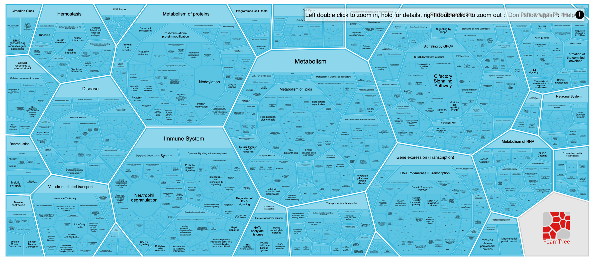
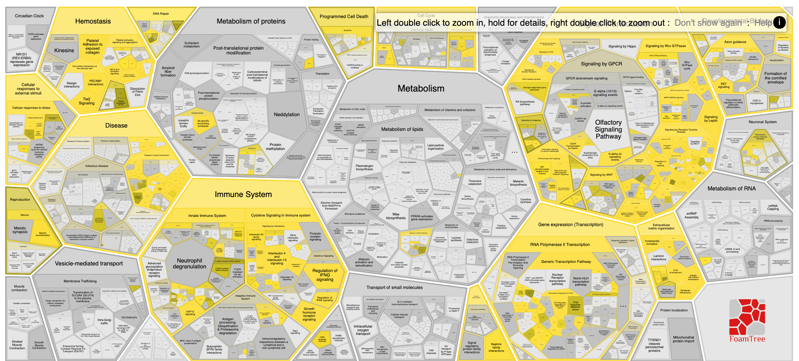

# Reacfoam
## About
A hierarchical visualisation of Reactome pathways in a voronoi treemap.

## Aim
  Visualisation of Reactome pathways and pathways analysis results,it's useful for figures, slides, etc. And easy navigation.

## Dependency

Reacfoam uses Foamtree as visualization library. FoamTree is a JavaScript Voronoi treemap visualization with innovative layouts,animated interactions and endless customization. More details at https://carrotsearch.com/foamtree/

## Features
* Varied layout
    *   Flattened(default)
        * A flattened view of the hierarchy, all levels of the hierarchical are visible at once.
    * Hierarchical
        *  A layered view of the hierarchy, only the top level of the hierarchy is visible and double click to "open" it for futher inspectioin.
* Interaction hints and guide
    *   Hints are provided at the right corner of visualization to guide users to interact with Reacfoam, zooming, selecting, and opening.
* Works on all modern desktop and mobile browsers responsively, it also supports touch event on tablets.
* Corresponding with the selected color profile at Reactome pathway browser.
* Hold a polygon to go to the current Reactome page for more details.

## Visualization Analysis Result
* The Reacfoam also supports to visualize the Reactome overrepresentation data type analysis results by receiving a token.
    * Corresponding with the selected color profile at Reactome analysis service.
    * Hold a polygon to go to the current Reactome page for more analysis details.

## Demo
A working version of Reacfoam has been integrated in dev [Reactome Pathway Browser](http://dev.reactome.org/reacfoam/).

